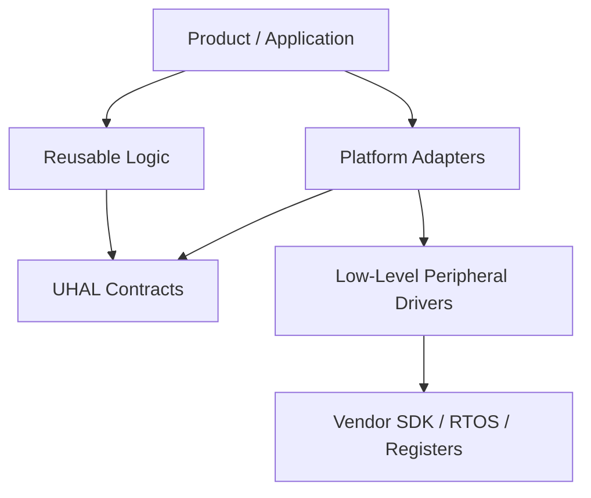

# UHAL Component Catalog

This repository is a reusable firmware component catalog based on a Unified Hardware Abstraction Layer (UHAL). Its goal is to assemble tested components into a new product instead of rewriting chip drivers, protocols, and product logic for every MCU or board.

```text
Application -> Sht3x -> II2c -> Stm32H5I2c -> STM32 HAL
Application -> Sht3x -> II2c -> Esp32C6I2c -> ESP-IDF
```

When porting from STM32H5 to ESP32-C6, the application and `Sht3x` remain unchanged. Only platform adapters and board configuration change.

## Goals

- Reuse logic across MCUs, boards, and RTOS environments.
- Isolate vendor SDKs, registers, DMA, IRQs, and pin mapping in platform code.
- Test device and protocol logic on the host with fake adapters.
- Make a new product primarily an exercise in selecting and composing components.

## Dependency Rules



```text
product -> reusable_logic -> uhal_interfaces <- platform_adapter -> low_level -> vendor_sdk
```

1. `devices`, `protocols`, and `services` may depend only on `components/uhal/core`, `components/uhal/interfaces`, or pure libraries.
2. Only code under `platform` may include STM32 HAL/LL, ESP-IDF, FreeRTOS, or register headers.
3. The product composition root is the only place that creates concrete adapters and injects dependencies.
4. Reusable logic must not use `#ifdef STM32` or `#ifdef ESP32`.
5. Contracts are small capability interfaces; do not create a large `IHal` interface.

## Architecture Layers

### Layer 1: Low-Level Platform Drivers

The closest catalog to hardware and the vendor SDK. It may know peripheral instances, pins, clocks, DMA requests, ISRs, and vendor error types.

- [STM32H5](components/platform/stm32/stm32h5): RCC, GPIO, DMA, I2C, SPI, UART, ADC, FDCAN, timers, security, and other peripherals.
- [ESP32-C6 ESP-IDF](components/platform/esp32c6/esp_idf): GPIO, GDMA, I2C, SPI, UART, TWAI, ADC, PWM, radio, storage, security, and other subsystems.

The current catalog files are placeholders. Implement only the peripherals required by a real board and use case.

### Board Configuration

`products/<product>/board/` owns PCB-specific facts: macros, pinout, clock tree, peripheral instances, baud rates, DMA mapping, interrupt priority, power enables, and startup configuration.

Board configuration is not a reusable platform driver. Two products may use the same adapter while routing the peripheral to different pins.

### Layer 2: UHAL Contracts

[components/uhal/interfaces](components/uhal/interfaces) defines platform-neutral capabilities:

| Contract | Capability |
|---|---|
| `II2c`, `ISpi`, `IUart`, `ICan` | I2C, SPI, UART, and CAN/CAN FD transport |
| `IGpio`, `IAdc`, `IPwm` | Digital I/O, analog read, and PWM output |
| `IClock`, `IStorage`, `IWatchdog` | Time, persistent storage, and system health |

Each object represents a configured resource. For example, `IGpio` does not receive a pin number on each call, `IAdc` does not receive a channel number on each read, and `IUart` does not receive a baud rate on each write.

### Layer 3: Platform Adapters

Adapters implement a UHAL contract with a layer-1 driver or vendor SDK and map vendor errors to `uhal::Status`.

```cpp
class Stm32H5I2c final : public uhal::II2c {
public:
    uhal::Status write(std::uint8_t address,
                        const std::uint8_t* data,
                        std::size_t size) override;
    uhal::Status read(std::uint8_t address,
                       std::uint8_t* data,
                       std::size_t size) override;
};
```

[STM32H5 adapters](components/platform/stm32/stm32h5/adapters) and [ESP32-C6 adapters](components/platform/esp32c6/esp_idf/adapters) contain skeletons for I2C, SPI, UART, CAN, GPIO, ADC, PWM, clock, storage, and watchdog. [Fake adapters](components/platform/fake) implement contracts for host tests.

Adapters must not contain device CRC, Modbus frames, or product policy. They translate UHAL capabilities to vendor APIs only.

ESP-IDF versioning is recorded in [esp_idf_v6.md](components/platform/esp32c6/esp_idf/compatibility/esp_idf_v6.md), not in every driver filename. Products pin an exact ESP-IDF release; API migrations use a compatibility shim or manifest instead of copying drivers.

### Layer 4: Reusable Logic

Reusable logic must not include a vendor SDK.

- [devices](components/devices): chip-specific register protocol, commands, CRC, conversion, retry, and state. `sht3x` is the working sample.
- [protocols](components/protocols): wire and application protocol framing, parsing, checksum, timeout, and retry. `modbus-rtu` is the working sample.
- [services](components/services): reusable policies such as logging, sampling, calibration, telemetry, offline queues, OTA, diagnostics, security, and power management.
- [libraries](components/libraries): pure algorithms independent from UHAL and SDKs, including CRC, serialization, state machines, ring buffers, filters, units, and retry/backoff.

The IoT catalog defines ownership boundaries and planned dependencies. Only `sht3x` and `modbus-rtu` currently contain implementation.

### Layer 5: Product Composition Root

[products](products) contains complete firmware products. `products/<product>/app/main.cpp` creates concrete adapters and injects them into reusable logic. `board/` owns PCB configuration.

```cpp
Stm32H5I2c sensor_bus{board_i2c_config};
Stm32H5Uart modbus_uart{board_uart_config};

devices::Sht3x environment_sensor{sensor_bus};
protocols::ModbusRtuMaster modbus{modbus_uart};
```

Changing platforms replaces `Stm32H5*` with `Esp32C6*`; drivers, protocols, and use cases remain unchanged.

## Project Tree

```text
.
├── CMakeLists.txt
├── README.md
├── Theory.md
├── components/
│   ├── uhal/                             # Layer 2 platform-neutral contracts
│   │   ├── core/                         # Status, common data types, and enums
│   │   └── interfaces/                   # II2c, IUart, IGpio, and other ports
│   ├── platform/
│   │   ├── fake/                         # Host-test adapters
│   │   ├── stm32/stm32h5/
│   │   │   ├── low_level/                # Layer 1: STM32 HAL/LL and IRQ access
│   │   │   └── adapters/                 # Layer 3: UHAL implementations
│   │   └── esp32c6/esp_idf/
│   │       ├── low_level/                # Layer 1: ESP-IDF access
│   │       └── adapters/                 # Layer 3: UHAL implementations
│   ├── devices/                          # Layer 4 chip drivers and IoT catalog
│   ├── protocols/                        # Layer 4 protocol catalog
│   ├── services/                         # Layer 4 product-independent policies
│   └── libraries/                        # Layer 4 pure algorithms
├── products/
│   └── env_monitor/                      # Layer 5 sample product
│       ├── app/main.cpp
│       └── board/
├── config/                               # Shared toolchain and CMake configuration
└── tests/
    ├── unit/                             # Host tests with fake adapters
    └── integration/                      # Board, wiring, timing, and transceiver tests
```

## Design Patterns

| Pattern | Use | Purpose |
|---|---|---|
| Ports and Adapters | Contracts are ports; STM32, ESP32, and fake implementations are adapters | Separates logic from hardware and SDKs |
| Dependency Injection | Constructors receive interface references | Makes dependencies explicit and testable |
| Composition Root | `products/<product>/app/main.cpp` | Controls the object graph in one place |
| Adapter | `Stm32H5I2c : II2c`, `Esp32C6I2c : II2c` | Maps vendor APIs to UHAL |
| Strategy | Interface implementation selected during composition | Changes platform without changing logic |
| Test Double | `FakeI2c`, `FakeUart` | Supports host testing without a board |
| Limited Facade | Small UHAL capabilities hide vendor SDKs | Simplifies APIs without creating a God HAL |

Do not use a Service Locator or Singleton as the primary dependency mechanism. They hide dependencies and make testing harder. A Factory is useful only when an adapter must be selected at runtime.

## SOLID Assessment

| Principle | Current status | Evidence and required discipline |
|---|---|---|
| SRP | Structurally aligned | Low-level code controls peripherals, adapters map APIs, devices understand chips, protocols understand wire formats, and products compose objects. |
| OCP | Extension-oriented | New platform adapters and devices can be added without changing existing device logic. |
| LSP | Not proven yet | Fake, STM32, and ESP32 adapters need shared contract tests for timeout, NACK, invalid input, and partial transfers. |
| ISP | Strong | I2C, UART, SPI, GPIO, and clock capabilities are separated instead of merged into `IHal`. |
| DIP | Strong in design | SHT3x depends on `II2c`, Modbus depends on `IUart`, and reusable logic does not link vendor SDKs. |

## Implementation Workflow

Use complete vertical slices instead of implementing every placeholder first:

1. Select an exact board, MCU, and use case, such as SHT3x on STM32H563.
2. Configure the board I2C, pins, and clocks.
3. Implement the required layer-1 I2C capability.
4. Write `Stm32H5I2c : II2c` and map vendor errors to `Status`.
5. Extend `FakeI2c` to capture requests and script responses or errors.
6. Complete SHT3x command, read, CRC, conversion, and error behavior.
7. Run host unit tests, adapter contract tests, and board integration tests.
8. Assemble the adapter and device at the composition root.

For RS-485 half-duplex, create a transport adapter around `IUart` and `IGpio` to control DE/RE. Modbus core must not know GPIO details.

## Testing

| Test | Environment | Verifies |
|---|---|---|
| Unit | Host | Frames, CRC, parsing, conversion, retry, and error paths |
| Contract | Host or target | Shared UHAL semantics for each adapter |
| Integration | Real board | Pinout, timing, pull-ups, DMA, IRQ, and transceiver behavior |
| Product | Board or SIL | Use cases, scheduling, recovery, and watchdog behavior |

## Build and Test

```powershell
cmake -S . -B build
cmake --build build
ctest --test-dir build --output-on-failure
.\build\products\env_monitor\env_monitor.exe
```

Remove generated artifacts after validation:

```powershell
Remove-Item -Recurse -Force build
```

## Checklist

- Reusable logic does not include a vendor SDK.
- Dependencies are explicit in `target_link_libraries`.
- Products use constructor injection to compose adapters and logic.
- Reusable logic has host unit tests.
- Board and MCU details live only in `platform/` or `products/<product>/board/`.
